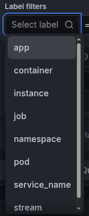

# Devlog 19 : Configuration d'Alloy et Loki : collecte et exploitation des logs

Depuis le début du cluster, j'ai eu l'occasion d'installer pas mal d'outils d'observabilité : Prometheus, Grafana, dashboards... J'avais déjà configuré, en partie simplement, ces outils. Le but est d'adapter le niveau de configuration à mes connaissances actuelles et de ne pas chercher à faire des choses complexes que je ne saurais pas comprendre. Quoi qu'il en soit, par choix, j'avais décidé de ne pas installer/configurer **Promtail**. Dès mes premières recherches, j'avais vu que Promtail était en cours de dépréciation. J'avais donc volontairement mis cette partie de côté, en attendant de m'attaquer directement à son successeur, **Alloy**.

## 1. Pourquoi Alloy ?

Suite à l'annonce de la fin de Promtail, le choix d'Alloy s'est imposé naturellement. Alloy reprend les fonctionnalités de collecte de logs de Promtail, tout en allant beaucoup plus loin puisqu'il s'agit d'un collecteur de télémétrie capable de gérer différents types de données. Alloy permet également de centraliser plusieurs fonctions de collecte au sein d'un même agent, là où l'on pouvait auparavant avoir plusieurs outils spécialisés.

De plus, Alloy utilise son propre langage de configuration, appelé **River**, un langage proche de la syntaxe **HCL** (_Terraform_). River introduit une logique de composants permettant notamment de connecter les différents éléments d'un pipeline. Un composant peut ainsi exposer des données utilisées par un autre composant, ce qui apporte davantage de flexibilité dans la construction des pipelines.

## 2. Problèmes rencontrés

Je n'avais pas touché à la partie Loki/Alloy de mon cluster depuis un moment. Comme dit ci-dessus, j'avais volontairement laissé ces outils de côté, c'est pourquoi, lorsque je m'y suis attaqué, j'ai remarqué pas mal de petites erreurs de configuration.

- **"Values file" manquant :** J'avais créé un fichier `alloy-values`, qui contient les valeurs Helm de mon application Alloy. Cette approche est plus propre, car elle permet de maintenir un manifeste d'application propre tout en séparant la partie configuration de l'application de la configuration de ses fonctionnalités. Cependant, j'ai remarqué que la **ConfigMap** déployée ne contenait pas ma configuration : elle contenait uniquement les informations de base. Le problème était que je n'avais pas créé de deuxième **`repoURL`** sous **`spec.sources`** dans mon application. Une fois ce problème réglé, la ConfigMap actualisée et les Pods redémarrés, tout est rentré dans l'ordre.

- **Dysfonctionnement Alloy-Loki :** Malgré une ConfigMap correctement déployée et des ressources indiquées comme **Healthy**, les logs n'étaient pas correctement exploitables dans Loki. Lorsque je réalisais mes premières requêtes de test depuis Grafana, les labels attendus n'étaient pas disponibles.

```yaml
discovery.relabel "pod_logs" {
targets = discovery.kubernetes.pods.targets

rule {
source_labels = ["__meta_kubernetes_namespace"]
action        = "replace"
target_label  = "namespace"
}

rule {
source_labels = ["__meta_kubernetes_pod_name"]
action        = "replace"
target_label  = "pod"
}

rule {
source_labels = ["__meta_kubernetes_pod_container_name"]
action        = "replace"
target_label  = "container"
}

rule {
source_labels = ["__meta_kubernetes_pod_label_app_kubernetes_io_name"]
action        = "replace"
target_label  = "app"
}
}
```

Comme nous pouvons le voir dans l'extrait de code ci-dessus, Alloy transforme certaines métadonnées Kubernetes en labels Loki : `namespace`, `pod`, `container`, `app`. Cependant, je n'avais rien de tout ça. Le problème était que le port était erroné dans mon bloc suivant :

```yaml
loki.write "homelab_loki" {
endpoint {
url = "http://loki-gateway.loki.svc.cluster.local:80/loki/api/v1/push"
}
}
```

Après vérification de ma configuration Alloy, le problème venait de l'endpoint utilisé par `loki.write` !

En effet, au départ, j'utilisais le port **3100**, mais ce port correspond au port de mon service direct de Loki. Le port **80**, lui, correspond au port exposé par le service **Gateway** de Loki. C'est lorsque j'ai apporté ce changement que je suis devenu en mesure de filtrer en utilisant mes propres labels.



## 3. Update générale

- **Évolution du mode de déploiement :** J'ai eu l'occasion de parcourir mon application Loki ainsi que son fichier `values`. En me renseignant sur la documentation Loki, j'ai constaté que la terminologie **SingleBinary** avait évolué vers **Monolithic**. J'ai donc profité de cette mise à jour pour adapter mon déploiement au vocabulaire utilisé dans la documentation actuelle. Ce format n'ajoute pas grand-chose de supplémentaire sur le plan technique ; il permet surtout à Loki de s'aligner avec les autres moyens de déploiement déjà présents : **Simple Scalable** et **MicroServices**, le tout permettant également une meilleure compréhension du mode de déploiement sélectionné.

- **Upgrade de la RAM :** J'ai eu la chance de pouvoir récupérer deux barrettes de RAM **SODIMM** sur un ancien ordinateur. Ces barrettes de 8 Go chacune se sont vu offrir une seconde vie en alimentant mes nœuds. Mon **master** ainsi que le **worker2** sont tous les deux passés à 16 Go de RAM chacun, pour un total de 40 Go de RAM répartis sur l'ensemble du cluster, une upgrade non négligeable pour la suite de l'aventure !

## 4. Concepts appris

- **Mode de déploiement Loki :** Je le savais déjà, mais le fait d'avoir relu la documentation Loki m'a permis de mieux me familiariser avec les différents modes de déploiement de Loki. Le changement de **SingleBinary** à **Monolithic** m'a permis de réviser les termes et de mieux les ancrer dans ma mémoire.

- **Alloy :** Je comprends mieux maintenant la complémentarité entre Loki et Alloy ainsi que leur rôle distinct. Alloy se charge ici de la collecte et du traitement des logs, tandis que Loki assure leur stockage et leur indexation. Il se charge ensuite de stocker les logs reçus et utilise leurs labels pour les organiser et permettre leur interrogation avec LogQL.

- **River :** La nouvelle syntaxe de configuration d'Alloy. Proche du langage HCL, River permet de connecter les différents composants entre eux et de construire des pipelines de traitement. Cette approche apporte davantage de flexibilité qu'une configuration basée uniquement sur des blocs indépendants.

# 5. Conclusion

Je revenais d'un petit mois et demi de pause suite à l'obtention de mon CCNA le 1er juillet 2026. Cette pause m'a permis non seulement de me reposer, mais aussi de remettre les choses en ordre pour le futur du cluster. Le tout a commencé avec cette mise à jour, qui m'a permis de mettre en fonctionnement toute la chaîne de collecte des logs du cluster. Je dispose maintenant d'une base fonctionnelle pour commencer à exploiter réellement ces données, notamment à travers LogQL et Grafana !

## 6. À venir

- Approfondissement de LogQL et de PromQL
- Implémentation d'un dashboard fonctionnel dédié aux logs
- Corrélation logs/métriques avec Prometheus
- Ajout d'alertes basées sur les logs via Alertmanager
- Déploiement des premières CiliumNetworkPolicies pour l'application Nginx

## 7. Mot de fin

Nous sommes le 31 août 2026, ma réorientation en BUT informatique commence dès demain, le 1er septembre 2026, qui marquera le début officiel de mon parcours dans l'informatique ! C'est maintenant que les choses sérieuses vont commencer et c'est aussi ici que je vais pouvoir mettre réellement en pratique tout ce que j'ai pu apprendre en autodidacte depuis maintenant 9 mois : Python, Java, cybersécurité, réseau, cloud, infrastructure...

Aussi, le début de l'année scolaire va me forcer à ralentir le rythme. Là où je sprintais jusqu'à maintenant, où j'ai pu apprendre énormément, va se transformer en marathon. Je ferai mon possible pour essayer de tenir à jour le cluster et de publier toutes les nouvelles modifications qui lui seront apportées, en plus de mes autres projets et projets scolaires.

Tout naturellement, je publierai à un rythme différent : moins de changements, peut-être, mais avec davantage de temps consacré à leur compréhension et à leur documentation.

Ce Devlog marque donc la fin d'un sprint et le début d'un marathon !
